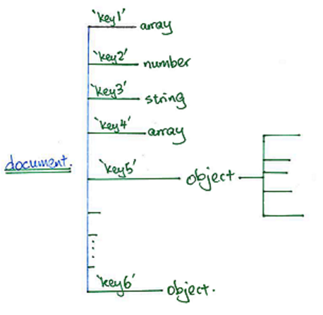

```{r, echo=FALSE, message=FALSE, warning=FALSE}
library(tidyjson)
library(rjson)
library(rmongodb)
library(dplyr)
dat3 <- readLines("../../dataset.json", n=3)
dat3 <- as.tbl_json(dat3)
```

## Outline

* NoSQL overview
* Neo4J overview
* R and MongoDB
    - `tidyjson`
    - Some simple analyses
* References

# NoSQL Overview

## Traditional RDBMS

1. **Atomicity**: Everything in a transaction succeeds unless it is rolled
back.
2. **Consistency**: A transaction cannot leave the database in an 
inconsistent state.
3. **Isolation**: One transaction cannot interfere with another.
4. **Durability**: A completed transaction persists, even after applications
restart.

## The NoSQL Approach

1. **Basic availability**: Each request is guaranteed a response -- 
successful or failed execution.
2. **Soft state**: The state of the system may change over time, at times 
without input.
3. **Eventual consistency**: The database may be momentarily inconsistent 
but will be consistent eventually.

## Types of NoSQL Databases

| Document/Key-Value | Column    | Graph
|--------------------|-----------|------
| MongoDB            | BigTable  | Neo4J
| CouchDB            | Hadoop    | FlockDB
| Redis              | Cassandra | 


## Some Benefits of NoSQL

- Schemaless data representation
- How would you represent graphs in RDBMS?
- Scalability
- Column - oriented databases.

# R to MongoDB


## R Support for MongoDB

- Main packages - RMongo, rmongodb and mongolite (newest)

Package   | Notes
----------|------------
RMongo    |   SQL style connection and querying, JSON format queries 
rmongodb  | BSON / JSON format queries 
mongolite | Released 2015.  

- Packages are very comparable for basic querying / retrieving 
- JSON style queryin format is common to all the packages
- Monoglite is the latest and supposedly good at aggregate queries 


## Connecting to MongoDB

As long as you have your MongoDB instance running, it is relatively 
painless to connect from R:

```{r connect_1}
mongo <- mongo.create(host="127.0.0.1",db="test")
mongo.is.connected(mongo)
```

This confirms the connection is up and working.

- For this session, we are going to use the `restaurants` collection within the  
`test` database.
- The data can be downloaded and imported into your database from 
[here](https://raw.githubusercontent.com/mongodb/docs-assets/primer-dataset/dataset.json):


## Some Simple Commands

```{r connect_2}
mongo.count(mongo, "test.restaurants")
tmp <- mongo.find.one(mongo, "test.restaurants")
class(tmp)
```

`mongo.bson` is native to the `rmongodb` package, and it mimics the bson 
documents that MongoDB works with.

## Exploring the Data

```{r connect_3}
tmp <- mongo.bson.to.list(tmp)

# can also use Hmisc::list.tree here:
str(tmp, max.level=1)
```

Let's consider using another package to explore the documents we get back.


# The `tidyjson` package

## JSON Document Structure



## tidyjson Verbs

- `tidyjson` works similarly to dplyr.
- It encourages the use of the `%>%` operator to chain operations.
- The main operations are the following:
    - `json_types()`
    - `json_lengths()`
    - `gather_array()`
    - `gather_keys()`
    - `spread_values()`
    - `append_values_X()`
    - `enter_object()`
- Please do refer to the vignette for more information:
```{r tidyjson_1, eval=FALSE}
vignette("introduction-to-tidyjson")
```
    
## From MongoDB to `tidyjson`

* There is a problem:
    - `tidyjson` works with its own `tbl_json` class of objects.
    - `rmongodb` works with its own `mongo.bson` class of objects.
    
* Neither package has a function to convert to/from the other class.

* We shall use the following workaround (Any better ideas??)
    - `mongo.bson` -> R list -> JSON string -> `tbl_json`
    - The conversion from R list to JSON string can be achieved using `toJSON()` 
    from the `rjson` package.
    
# Analysis 0: Grades

## Restaurant Names and Grades

Suppose that we wish to obtain a data frame consisting of all restaurants 
and their grades.

Since we have a small dataset, let's read it all in and store it in R:
```{r read_all}
all_data <- mongo.find.all(mongo, "test.restaurants")
length(all_data)
format(object.size(all_data), units="Mb")
```


# Analysis 1: Above B

## Good Restaurants

Suppose that we wish to obtain a data frame consisting of all restaurants 
that have never had a grade below B.

The unique grades are 
```{r unique_grades, eval=FALSE}
unique(out2a$grade)
```

# Analysis 2: Which deteriorated?

## Got Worse

Suppose we are interested in knowing how many, or which restauarants' grading 
got worse?

    - Which restaurants have ever been graded lower than what they started out as?

```{r eval=FALSE, analysis_3}
# write a helper function
got_worse <- function(tmp) {
  gr <- tmp$grade
  data.frame(worsened = any(tmp$grade[-1] > tmp$grade[1]), 
             name=tmp$name[1], stringsAsFactors = FALSE) 
  } 
out2b %>% group_by(id) %>% filter(n() >= 2) %>% do(got_worse(.)) -> worsened
head(worsened)
```

# Streaming Data


## Iterating Over All Objects
```{r analysis_4a}
cursor <- mongo.find(mongo, "test.restaurants")
#while(mongo.cursor.next(cursor)) {
#  print(mongo.cursor.value(cursor))
#  
#}
mongo.cursor.destroy(cursor)
```
    
# References

## References

```{r mongo_out, messages=FALSE, echo=FALSE}
mongo.destroy(mongo)
```

1. Getting Started with NoSQL, *Gaurav Vaish*
2. `rmongodb` vignette
3. `tidyjson` vignette
  

    
